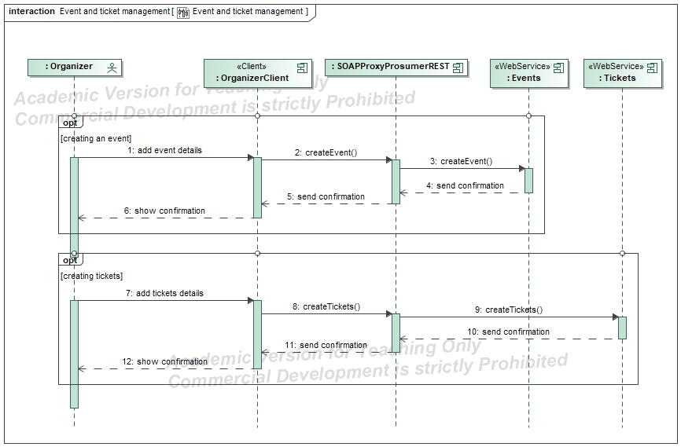
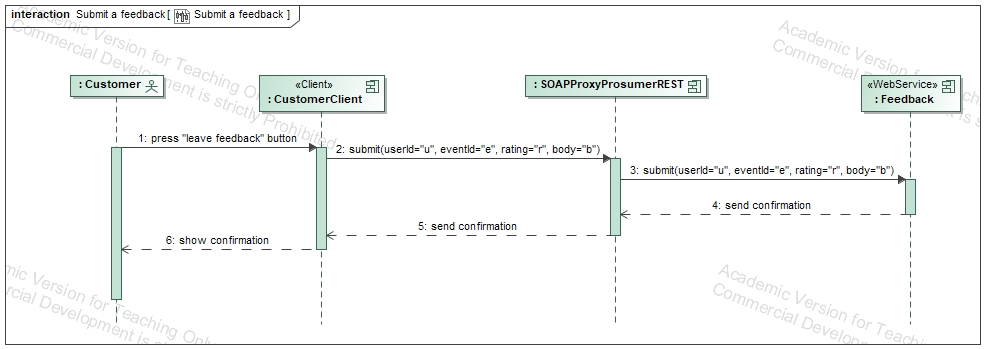

# Event and ticket management - Project for S.O.S.E. (A.Y. 23-24).

  

### Members names and contacts:
1) Dario D'Ercole - (288643) - dario.dercole@student.univaq.it
2) Giovanni Spaziani - (295397) - giovanni.spaziani@student.univaq.it

# Table of Contents
- [Scenarios](#scenarios)
- [Sezione 1](#sezione-1)
- [Sottosezione 1.1](#sottosezione-11)
- [Sezione 2](#sezione-2)

#### First of all, ensure to clone the repository, by writing the following command: git clone https://github.com/Lindbrum/DaGi-sose-23-24.git
1) #### Install the applications: "Docker Desktop" and "SprintToolSuite4".
2) #### To see the code, open the IDE "SpringToolSuit4" and import the projects by right click on the package explorer, then: import -> Maven -> Existing Maven Project -> Browse -> and then select the repository where u cloned the projects.
3) #### Open "Docker Desktop".
4) #### Run the command "docker-compose up" in a terminal pointing to the folder where is the cloned repository. You have to wait about 15 minutes to download all dependencies.

5) Services pages can be visited with the following URLs:

   - ##### discovery-server: http://localhost:8761
   - ##### event-management-soap: http://localhost:8081/event-management-soap/
   - ##### feedback-prosumer-rest: http://localhost:8082/api/feedback-prosumer/services
   - ##### event-merch-prosumer-rest: http://localhost:8083/api/event-merch-prosumer-rest/services
   - ##### sales-analysis-prosumer-rest: http://localhost:8084/api/sales-analysis-prosumer-rest/services
   - ##### merchandising-rest: http://localhost:8085/api/merchandise-rest/services
   - ##### authentication-rest: http://localhost:8086/api/authentication-rest/services
   - ##### soap-proxy-prosumer-rest: http://localhost:8087/api/soap-proxy/services

6) #### Open SwaggerUI by clicking the link given in the service page.
7) #### To test the APIs, you have to copy-and paste the path given in the URL query parameter in the search bar of SwaggerUI to open our Swagger definition.
8) To play with the clients, go to SprintToolSuite4, search for "customer-client" and "organizer-client" and run as java application with:
   - Main named "CustomerClientapplication" for the "customer-client". Run it and play with the console.
   - Main named "OrganizerClientapplication" for the "organizer-client". Run it and play with the console.

## Scenarios

### - Creating an event.

| Description | Services involved |
| --- | --- |
| An event organizer uses the system to create and manage a new event. The SOAP event management service is used to enter event information, such as title, description, dates, location, and maximum number of participants. | 1.&nbsp;EventManagementSOAP.   2.&nbsp;SOAPProxyProsumerREST. |

#### Interactions:
1) The organizer enters the event details into the client.
2) The client sends a request to the SOAP proxy requesting to save a new Event.
3) The SOAP proxy forwards the request to the Event SOAP endpoint.
4) The SOAP service stores the event details in the database and assigns an event ID.
5) The SOAP service then notifies the SOAP proxy of the operation, which in turn notifies the client.
6) The client notifies the organizer that the event was successfully created.

### - Viewing the event catalogue and previewing merchandising.

| Description | Services involved |
| --- | --- |
| A user of the platform wants to browse the catalogue of available events and view the details of a specific event, including a preview of the merchandise items that will be available during the event. Use the client to search, view and get all the information needed. | 1.&nbsp;EventManagementSOAP.   2.&nbsp;SOAPProxyProsumerREST.   3.&nbsp;MerchandisingREST.   4.&nbsp;EventMerchProsumerREST.|

#### Interactions:
1)	The user logs into the client and selects the option to view the event catalogue.
2)	The client sends a request to the SOAP proxy requesting the first page of the event catalogue, sorted by newest.
3)	The SOAP proxy forwards the request to the Event SOAP endpoint, which answers with a list containing a list of events.
4)	The SOAP proxy relays the answer to the customer’s client, which displays the catalogue page, showing for each event the name, a short description and the running date
   4.1)	The customer can then navigate between catalogue pages, in which case points 2 and 3 repeats but on the selected catalogue page
   4.2)	The customer can changed the sorting method of the catalogue between “newest”, “oldest”, “A to Z” and “Z to A”, in which case points 2 and 3 repeats but with a new sorting method
5)	The user selects an event from the list to view full details.
6)	The client sends a request to the EventMerch prosumer, providing the id of the event.
7)	The EventMerch prosumer requests the full details of the event to the Event SOAP endpoint.
8)	The EventMerch prosumer requests the list of merchandise to the Merchandising service.
9)	Once both providers answer, the prosumer returns the data aggregated in a single object.
10)	The client after receiving the answer from the prosumer displays the event details and the merchandise list.

### - Viewing and purchasing tickets.

| Description | Services involved |
| --- | --- |
| A user is viewing the details of an event and decides to purchase a ticket. The Ticket SOAP service shows available tickets and the customer decides the one to buy. At this point the service process the purchase resulting in ticket payment and recording of the sale info. | 1.&nbsp;EventManagementSOAP.   2.&nbsp;SOAPProxyProsumerREST.   3.&nbsp;MerchandisingREST.|

#### Interactions:

1)	The customer is viewing the event details, and selects the option to purchase a ticket.
2)	The client sends a request to the SOAP proxy requesting the ticket availabilities.
3)	The SOAP proxy forwards the request to the Ticket SOAP endpoint.
4)	The Ticket service answers with a list of the available tickets, which the proxy returns to the customer’s client.
5)	At this point the client displays the available tickets and the customer selects one of them.
6) The client send a request to the SOAP proxy requesting to purchase the selected ticket.
7)	The SOAP proxy forwards the request to the Ticket SOAP endpoint, which in turn register the ticket sale.
8)	The Ticket service notifies the SOAP proxy of the operation, which In turn notifies the client.
9)	The customer’s client shows a confirmation message of the purchase.

### - Report generation and feedback.

| Description | Services involved |
| --- | --- |
| After the conclusion of an event, the organizer wants to obtain a detailed report that includes user feedback and sales statistics. The FeedbackProsumer and SalesAnalysisProsumer work together to generate this report. | 1.&nbsp;FeedbackProsumerREST.   2.&nbsp;SalesAnalysisProsumerREST.   3.&nbsp;EventManagementSOAP.|

#### Interactions:

1)	The organizer logs in to the client and requests a report for a specific event (asynchrony refers to point 2, 2.1 and 2.2).
2)	The client sends asynchronous requests to the FeedbackProsumer and SalesAnalysisProsumer:
   2.1)	The FeedbackProsumer collects event feedback from the "Feedback" service, within EventManagementSOAP.
   2.2)	At the same time, the SalesAnalysis prosumer collects ticket sales data from the Tickets service, within EventManagementSOAP.
3)	The two prosumers synchronize and aggregate the collected data into a single report.
4)	The aggregate report is then sent to the client and displayed to the organizer.

## Component diagram

  

## UseCase diagram

  

## Profile diagram

  

## S.D. Event and ticket management

  

## S.D. Explore event catalogue

  

## S.D. Generating a report

  

## S.D. Merchandising

  

## S.D. Submit a feedback

  

## S.D. Ticket history

  

## S.D. Tickets visualization & purchase

  

## S.D. Visualize event

  

